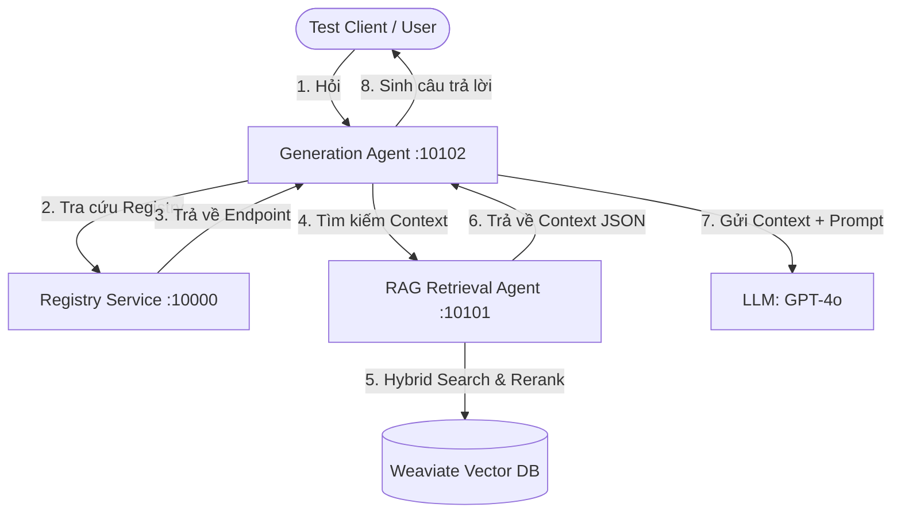

# Walkthrough: Di Chuyển RAG Pipeline v2 sang Kiến Trúc Multi-Agent A2A (Day 8)

Hệ thống RAG nguyên khối (monolithic) ban đầu của Day 8 đã được chuyển đổi thành một kiến trúc Multi-Agent phân tán sử dụng bộ khung giao tiếp **Agent-to-Agent (A2A)** từ Day 9.

---

## 1. Kiến Trúc Hệ Thống Multi-Agent RAG

Hệ thống hoạt động theo cấu trúc phân rã chức năng (Separation of Concerns) như sau:



- **Registry (Cổng 10000)**: Quản lý danh sách, endpoint của các Agent đang hoạt động.
- **RAG Retrieval Agent (Cổng 10101)**: Đóng gói pipeline tìm kiếm Hybrid Search (Dense + Sparse) kết hợp Jina Reranking từ Day 8.
- **Generation Agent (Cổng 10102)**: Xử lý logic LangGraph, triệu gọi Retrieval Agent lấy context qua A2A, sắp xếp lại tài liệu để tránh "lost in the middle", và sinh câu trả lời tiếng Việt có kèm nguồn trích dẫn (citation) đầy đủ.

---

## 2. Các Thay Đổi Chính Trong Codebase (Day 8)

1. **Bộ Khung A2A**:
   - Tích hợp thư mục `registry/` và các client `common/a2a_client.py`, `common/registry_client.py` trực tiếp vào workspace Day 8.
   - Nâng cấp `common/llm.py` hỗ trợ cả Nvidia NIM (khi phát hiện `nvida_key` trong `.env`) và OpenRouter (mặc định sử dụng model `openai/gpt-4o`).

2. **RAG Retrieval Agent (`rag_retrieval_agent/`)**:
   - `agent_executor.py`: Đăng ký tool `hybrid_search_tool` trực tiếp sử dụng hàm `retrieve()` từ `src/task9_retrieval_pipeline.py`.
   - `__main__.py`: Khởi chạy FastAPI App trên cổng `10101`, tự động đăng ký tác vụ `"rag_retrieval"` với Registry.

3. **Generation Agent (`generation_agent/`)**:
   - `graph.py`: Định nghĩa LangGraph gồm 2 node `retrieve_context` (giao tiếp A2A đến Retrieval Agent) và `generate_answer` (gọi LLM sinh câu trả lời).
   - `agent_executor.py`: Cầu nối điều khiển LangGraph khi nhận tin nhắn từ A2A.
   - `__main__.py`: Khởi chạy FastAPI App trên cổng `10102`, đăng ký tác vụ `"legal_generation"`.

4. **Kịch Bản Kiểm Thử & Tích Hợp**:
   - `start_all.ps1` và `start_all.sh`: Các script tự động khởi động toàn bộ cụm Multi-Agent dưới nền.
   - `test_a2a_rag.py`: Client kiểm thử mô phỏng gửi câu hỏi và nhận kết quả dạng A2A.

---

## 3. Kết Quả Kiểm Thử Thực Tế

Khi chạy truy vấn kiểm thử: **"Hình phạt cho tội tàng trữ trái phép chất ma tuý theo pháp luật Việt Nam?"**, hệ thống hoạt động trơn tru qua luồng A2A:

```
Connecting to Generation Agent at http://localhost:10102
Connected to agent: Generation Agent v1.0.0
------------------------------------------------------------
Sending request to Generation Agent (will invoke Retrieval Agent via registry)...

[Timer] Request completed in 20.80 seconds

RESPONSE:
============================================================
Theo quy định của pháp luật Việt Nam, hành vi tàng trữ trái phép chất ma túy (không nhằm mục đích mua bán, vận chuyển, sản xuất) sẽ bị xử lý hình sự theo quy định tại Điều 249 Bộ luật Hình sự năm 2015 (sửa đổi, bổ sung năm 2017). Hình phạt được chia thành các khung cụ thể dựa trên khối lượng ma túy tàng trữ và mức độ vi phạm như sau:

1. Khung hình phạt cơ bản (Phạt tù từ 01 năm đến 05 năm)
Khung này áp dụng đối với người tàng trữ trái phép chất ma túy thuộc một trong các trường hợp sau:
...
* Nhựa thuốc phiện, nhựa cần sa hoặc cao côca có khối lượng từ 01 gam đến dưới 500 gam.
* Heroine, Cocaine, Methamphetamine, Amphetamine, MDMA hoặc XLR-11 có khối lượng từ 0,1 gam đến dưới 05 gam.
...
(Nguồn: [Bộ luật Hình sự năm 2015 (sửa đổi, bổ sung năm 2017), Điều 249, Khoản 1])

2. Các khung hình phạt tăng nặng
* Phạt tù từ 05 năm đến 10 năm (Khoản 2): Áp dụng đối với các trường hợp tàng trữ có tổ chức, phạm tội 02 lần trở lên... [Bộ luật Hình sự năm 2015 (sửa đổi, bổ sung năm 2017), Điều 249, Khoản 2].
* Phạt tù từ 10 năm đến 15 năm (Khoản 3)... [Bộ luật Hình sự năm 2015 (sửa đổi, bổ sung năm 2017), Điều 249, Khoản 3].
* Phạt tù từ 15 năm đến 20 năm hoặc tù chung thân (Khoản 4)... [Bộ luật Hình sự năm 2015 (sửa đổi, bổ sung năm 2017), Điều 249, Khoản 4].

3. Hình phạt bổ sung
...
============================================================
```

---

## 4. Hướng Dẫn Vận Hành

### Bước 1: Khởi động toàn cụm Agents
Trong thư mục `Day08_RAG_pipeline_cohort2`, chạy lệnh PowerShell:
```powershell
.\start_all.ps1
```
*(Hoặc chạy lệnh bash: `sh start_all.sh`)*

### Bước 2: Chạy kiểm thử
```powershell
a:\AIK20_aithucchien\Batch02-Day9_Multi-Agent_MCP-A2A\.venv\Scripts\python.exe test_a2a_rag.py
```
